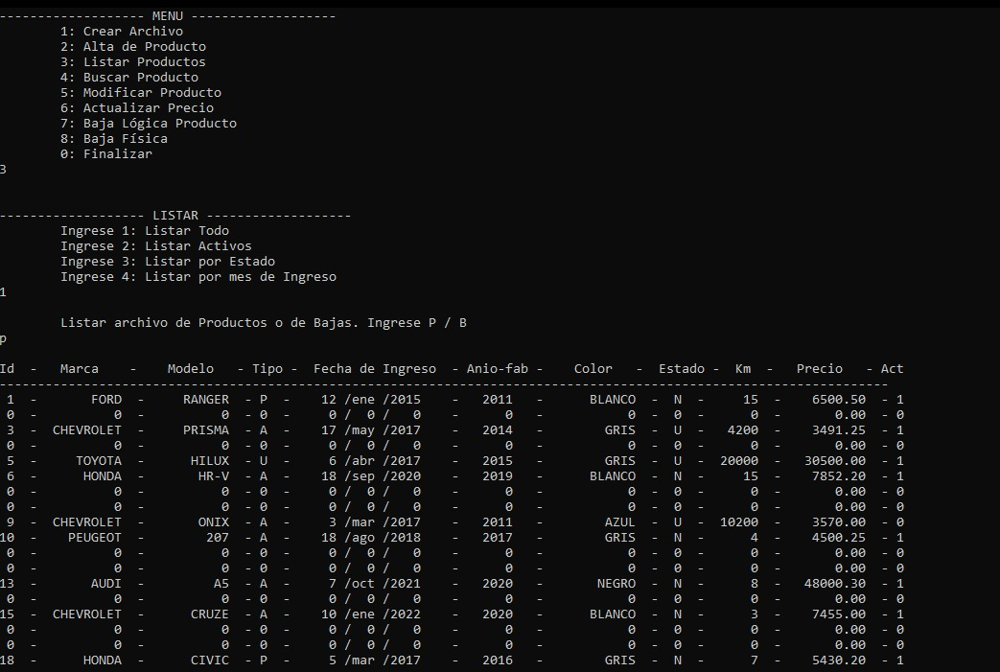

# PROGRAMA EN ANSI C

:computer: Este programa guarda los datos ingresados por el usuario en un archivo del tipo .dat 

:raising_hand_woman: Desarrollado por Denise Mayra Higa en Ansi C   

## Uso

1: Crea el archivo y si ya existe lo resetea

2: Ingreso de datos -segun ID- por parte del usuario y alta del producto

3: Listar productos (Optar por Archivo de Productos o Archivo de Bajas)  
    -> Todos 
    -> Activos 
    -> Por Estado 
    -> Por Mes de Ingreso 

4: Buscar (Unicamente Archivo de Productos) 
    -> Por Marca (Lista todos los productos por la marca) 
    -> Por Kilometraje (Usuario ingresa el rango de valores) 

5: Modificar (Buscando por ID o Modelo) 
    -> Tipo 
    -> Precio 
    -> Kilometraje 

6: Actualizar Precio según la Marca
    -> Eligiendo aumento o disminución. Ingresa el porcentaje

7: Baja Lógica ingresando el ID 

8: Baja Física 
    -> Los productos dados de baja en el Archivo principal se mueven a un Archivo de Bajas y se limpian los campos en el Archivo principal para nuevos ingresos.

